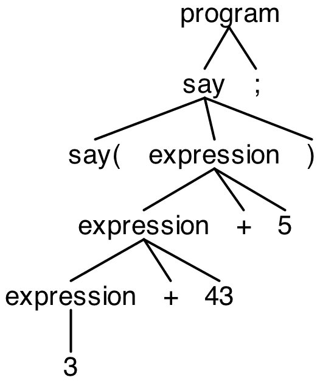

E Compiler
============

# Description
The *E compiler* is computer software that transforms computer code written in the source language *E* (see *main.e*) into an assembler program in the form of a symbolic notation of commands using [Jasmin](http://jasmin.sourceforge.net). The advantages are optimization and a lower overhead. *Jasmin* is an assembler to create class files from assembler-like syntax using the JVM instruction sets. Moreover, [ANTLR](http://jasmin.sourceforge.net) is used as parser generator for reading, processing, executing and translating the structured text. Therefore, it creates a lexer as well as parser for the grammar *grammar/E.g4*. Rules consisting only of majuscule refer to the lexer and rules consisting only of minuscules refer to the parser. The workflow works as follows:

1. **Lexical analysis**: Recognizes words (lexemes) like digits or '+' from the source code with finite automatons (regular expressions). Each lexeme consists of at least one or more characters. Comments are ignored.
2. **Syntax analysis**: Builds a logical structure (AST) using a top down parser. The grammar corresponds to *LL(k)* whereby *k=1* denotes the lookahead, that means the next production is predicted on the basis of tokens whereby the content of the PDA is taken into account. The PDA processes the input from left to right by calculating a left derivation.
3. **Context Analysis**: Attributes the AST through declaration analysis and type analysis (ASG). The declaration analysis checks whether a declaration exists before use. So there is an automatic error handling. For example, the type analysis checks whether formal and current parameters match.
4. **Synthesis**: Creates assembler instructions. Since the grammar is defined recursively, the instructions are generated by a post order traverse. Allocation (components), binding (mapping from functions to components) and flow chart are taken into account. Specifically, expressions such as commands are transformed using the necessary instructions. Then, byte code is generated from it which can be executed in the JVM.

Hash tables are used to enable fast access to identifiers, strings and other constructs. To avoid problems, keywords are reserved and the layout is not ignored. For this reason, the finite automats do not need a lookahead. Furthermore, the context-free grammar is unique, i.e. the parser is deterministic. In this way, mathematical rules are implicitly observed. Before starting the code generation, a global optimization is also carried out. For example, isomorphisms are eliminated. After the code generation, there is a local optimization whereby commands are rearranged.

## Prerequisites
+ [JDK 8](http://www.oracle.com/technetwork/java/javase/downloads/jdk8-downloads-2133151.html) or later
+ [ANTLR4](http://www.antlr.org) for reading, processing, executing and translating the structured text
+ [Jasmin](http://jasmin.sourceforge.net) to convert ASCII descriptions of Java classes into binary Java class files, suitable for loading by a Java runtime system
+ [Maven](http://maven.apache.org) to manage this project

## Installation
At first, clone or download this project. Since Jasmin does not exist as an official Maven repository, it must be installed as a local repository:

```
$ cd lib
$ mvn install:install-file -Dfile=jasmin.jar -DgroupId=net.sourceforge -DartifactId=jasmin -Dversion=2.4.0 -Dpackaging=jar
```

Afterwards, go to the terminal and type `mvn install` to create and install the related JAR file. The *target* folder now contains two JARs, with the dependencies embedded in one JAR. The following command starts the main routine:

```
$ java -cp target/e_compiler-0.0.1-SNAPSHOT-jar-with-dependencies.jar com.runekrauss.compiler.Main
```

To delete the created folder *target*, the command `mvn clean` must be executed. To execute the unit tests, there is the command `mvn test`. To ensure the code quality, [Google Java Format](https://github.com/google/google-java-format) was still used which formats the code. [Checkstyle](https://maven.apache.org/plugins/maven-checkstyle-plugin/) was also used. It can find class design problems, method design problems. It also has the ability to check code layout and formatting issues. To re-format the code, simply use the command `mvn com.coveo:fmt-maven-plugin:format`. For static code analysis the command `mvn checkstyle:check` must be entered.

## Language components
Among others the following features are offered:

+ Imports like `use(e.io.reader)`
+ Import calls like `String r = reader.read(): String;`
+ Macro Instructions like `#define noMain`
+ Outputs like `print("world");`
+ Variable declarations or assignments like `int a;` as well as `float a = 5.3;`
+ Function definitions like `void foo(int a, int b) { print(a*b); }`
+ Function calls like `foo(7, 8);`
+ Branches like `if (x) { a = 5; } else { a = 7; }`
+ Loops like `int i = 0; while (i < 3) { println(i); i = i + 1; }`
+ Built-in functions like `toInt(3.7);`
+ Inline assembler like `invoke "static" "java/lang/System/nanoTime"() "J";`
+ Structures like `struct Point { int x; int y; }`
+ Struct initializations like `Point p = new Point(1, 2);`
+ Arrays like `int[] a = new int[5];`
+ Arithmetic operators like `a + b`
+ Shift operators like `a >> b`
+ Relational operators like `a <= b`
+ Logical operators like `a && b`

In addition, there is comprehensive error handling. For example, it is impossible to use a variable without a declaration or to use operations with incompatible data types.

## Usage
Navigate to the folder *target* and type `java -jar *.jar` to execute the created JAR file. 

For example, to work with the project, it can be imported as a maven project into the IDE *IntelliJ*. Let us assume, for example, that the example rule *test* is to be inserted.

If the grammar is changed, the code must be adapted. To do this, the following commands must be executed after the change:

```
$ cd grammar
$ antlr -package com.runekrauss.parser -o ../src/main/java/com/runekrauss/parser/ -no-listener -visitor E.g4
```

Now look into the class *EBaseVisitor* where you will find a method called *visitTest*:

```
public T visitTest(EParser.TestContext ctx) { return visitChildren(ctx); }`
```

This method must be overwritten in the class *EVisitor* with the respective actions to traverse the tree. To test the code, the array in the method *provideCodeExpectedOutput* of the class *CompilerTest* must be extended. To view the corresponding tree, you can use the *TestRig* tool as follows:

```
$ cd target
$ java -cp classes:../lib/antlr.jar org.antlr.v4.gui.TestRig com.runekrauss.parser.E program -gui ../e/test/main.e
```

Then, a graphical user interface opens which displays the tree.

## Example

Let's assume the following code exists:

```
print(3+2*4);
```

Here, for example, a digit or ';' is a lexeme. The corresponding tree looks like this:



This produces over post order traverse the following assembler-like instructions:

```java
.class public e_test_main
.super java/lang/Object

.method public static main([Ljava/lang/String;)V
   .limit stack 4
   .limit locals 1

   getstatic java/lang/System/out Ljava/io/PrintStream;
   ldc 3
   ldc 2
   ldc 4
   imul
   iadd
   invokevirtual java/io/PrintStream/print(I)V

   return
.end method
```

Finally, the code can be translated into a class file using *Jasmin*. Then, it can be interpreted and executed in the *JVM*. This process is also automated in the main program. A more complex example shows the handling of further data structures like *arrays* or *structs*:

```java
// Different library imports
use(e.std.math)

/**
 * A point in a two-dimensional space
 *
 * @author Rune Krauss
 */
struct Point1 {
  int x;
  int y;
}

/**
 * One more point in a two-dimensional space
 *
 * @author Rune Krauss
 */
struct Point2 {
  float x;
  float y;
}

/**
 * Finds the square root of an integer.
 *
 * @param x Integer
 * @return Square root
 */
int sqrt(int x) {
  int result;
  // Illegal
  if (x < 0) {
    result = -1;
  }
  // Base cases
  if (x == 0 || x == 1) {
    result = x;
  } else {
    int temp = 1;
    int i = 1;
    /*
     * Starting from 1, try all numbers until
     * i*i is greater than or equal to x
     */
    while (temp <= x) {
      i = i + 1;
      temp = i * i;
    }
    result = i - 1;
  }
  return result;
}

/**
 * Calculates the distance between two points.
 *
 * @param x1 X value of the first point
 * @param y1 Y value of the first point
 * @param x2 X value of the second point
 * @param y2 Y value of the second point
 * @return Distance
 */
int dist(int x1, int y1, int x2, int y2) {
    int part1 = math.square(x2-x1): int;
    int part2 = math.square(y2-y1): int;
    int result = sqrt(part1+part2);
    return result;
}

// Create different points
Point1 p1 = new Point1(5, 2);
Point2 p2 = new Point2(3.7, 4.1);
p1.x = 1;

// Calculate the distance between these points
int dist = dist(p1.x, p1.y, toInt(p2.x), toInt(p2.y));

// Save the result in a list
int[] list = new int[3];
list[0] = dist;

// Output some information about the list
String txt = "Result: ";
String output = append(txt, toString(dist));

print(output);
```
The following output results from this:

```
Result: 2
```

## More information
Generate the documentation of this project regarding the special comments with a command in your terminal, for example:

```
$ cd java
$ javadoc -d doc com.runekrauss.compiler
```

Afterwards, you will get a website with helpful information about the code. There is also a [term paper](https://github.com/RuneKrauss/chartam) describing the functionality of the compiler.