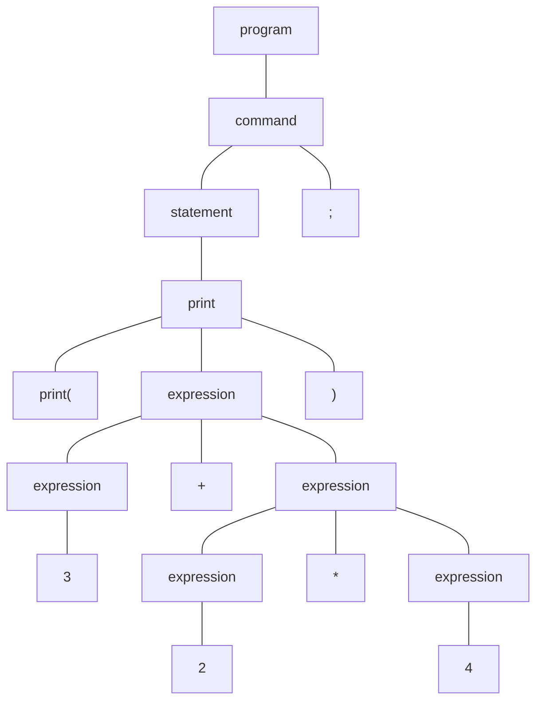

# E Compiler

**E Compiler** is a program that transforms computer code, written in the **E programming language**, into **bytecode** by using [ANTLR](https://www.antlr.org) and [Jasmin](http://jasmin.sourceforge.net) for reasons of optimization as well as a lower overhead.

## :dart: Features

* Variables: `int a;` and `float a = 5.3;`
* Operators: `a + b`, `a <= b`, `a && b`, and `a >> b`
* Outputs: `print("Hello World.");`
* Branches: `if (x) { a = 5; } else { a = 7; }`
* Loops: `int i = 0; while (i < 3) { println(i); i = i + 1; }`
* Functions: `void foo(int a, int b) { print(a * b); }` and `foo(7, 8);`
* Built-in functions: `toInt(3.7);`
* Arrays: `int[] a = new int[5];`
* Structures: `struct Point { int x; int y; }` and `Point p = new Point(1, 2);`
* Macros: `#define noMain`
* Imports: `use(e.io.reader)` and `String r = reader.read(): String;`
* Inline assembler: `invoke "static" "java/lang/System/nanoTime"() "J";`
* And much more

## :rocket: Getting Started

### :wrench: Installation

Since Jasmin doesn't exist as an official [Maven](https://maven.apache.org) repository, it must be installed locally. Download the [latest version](http://jasmin.sourceforge.net) and move it to the root directory of this cloned repository:

```console
$ mkdir lib
$ cd lib
$ mvn install:install-file -Dfile=jasmin.jar -DgroupId=net.sourceforge -DartifactId=jasmin -Dversion=2.4.0 -Dpackaging=jar
```

Then type `mvn install` in the terminal to create and install the appropriate JAR file. The *target* directory now contains two JARs, with the dependencies embedded in one JAR.

### :computer: Usage

The file [main.e](e/test/main.e) contains the most used [features](#dart-features) of E and demonstrates the calculation of a distance between two points.

Just type `java -cp target/e_compiler-0.0.1-SNAPSHOT-jar-with-dependencies.jar com.runekrauss.compiler.Main` to compile and run this file. The output should be `2`.

Generally, the created JAR file can be executed by `java -jar *.jar`.

## :eyes: Examples

### :large_orange_diamond: Compilation Process

Let's assume the following code exists:

```
print(3 + 2 * 4);
```

The corresponding abstract syntax tree, generated by ANTLR, looks like this:



Subsequently, the following assembler-like instructions are generated by post-order traversal:

```
.class public e_test_main
.super java/lang/Object

.method public static main([Ljava/lang/String;)V
   .limit stack 4
   .limit locals 1

   getstatic java/lang/System/out Ljava/io/PrintStream;
   ldc 3
   ldc 2
   ldc 4
   imul
   iadd
   invokevirtual java/io/PrintStream/print(I)V

   return
.end method
```

Now the code can be translated into a class file using Jasmin. Then, it can be interpreted and executed in the JVM. This process is also automated in the main program.

### :large_orange_diamond: Implementing a Rule

To work with this project, it can be imported into the IDE [IntelliJ IDEA](https://www.jetbrains.com/idea/).

Let's assume that a rule *test* should be implemented. When the grammar is changed, the code must be modified:

```console
$ cd grammar
$ antlr -package com.runekrauss.parser -o ../src/main/java/com/runekrauss/parser/ -no-listener -visitor E.g4
```

Now look into the `EBaseVisitor` class, where you will find a method called `visitTest`:

```java
public T visitTest(EParser.TestContext ctx) { return visitChildren(ctx); }
```

This method must be overwritten by the `EVisitor` class with the appropriate actions to traverse the tree. To view the corresponding tree, you can use the *TestRig* tool as follows:

```console
$ cd target
$ java -cp classes:../lib/antlr.jar org.antlr.v4.gui.TestRig com.runekrauss.parser.E program -gui ../e/test/main.e
```

To test the code, the array inside the method `provideCodeExpectedOutput` of the class `CompilerTest` must be extended.

## :white_check_mark: Tests

To run the unit tests, there is the command `mvn test`.

## :book: Documentation

The E Compiler documentation becomes available by typing the following commands in the terminal:

```console
$ cd java
$ javadoc -d doc com.runekrauss.compiler
```

## :warning: License

E Compiler is licensed under the terms of the [MIT license](LICENSE.txt).

## :scroll: Acknowledgments

Special thanks to Berthold Hoffmann for supporting this project.
